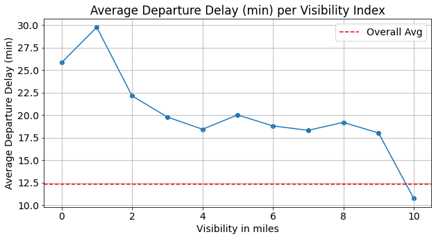
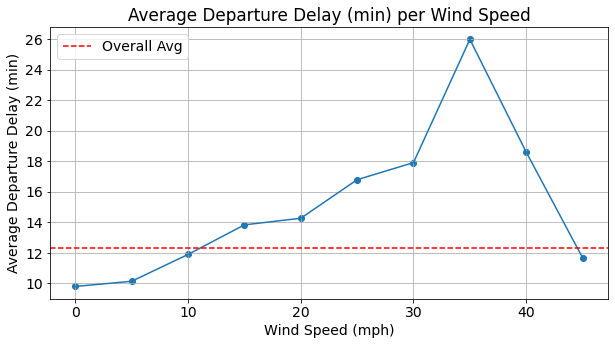

[](https://colab.research.google.com/drive/14rrWVXvlPyCMtWg6wBA9wcAMm3vP5APx?usp=sharing) for a version with Plotly figures

# SQL with nycflights13 data

'nycflights13' is a relational database with airline on-time data for all flights departing NYC in 2013 as well as related tables of airlines, airports, planes and weather.

In this notebook, I perform an exploratory and descriptive analysis mainly looking into how the departure delay time of each flight is related to other variables. In specific, the following questions are asked:
- Which airlines are dominant at each origin airport?
- Top 10 days with the largest number of flights
- Is the departure delay time varying across airlines?
- What is the relation between the departure delay time and weather factors?


```python
import sqlite3
import pandas as pd
import matplotlib.pyplot as plt
import seaborn as sns
%matplotlib inline
```


```python
# Connect to the db file in the current directory and list all the tables

conn = sqlite3.connect('nycflights13.db')
q = '''
SELECT * FROM sqlite_master WHERE type='table'
'''
pd.read_sql_query(q, conn)
```


<div>
<style scoped>
    .dataframe tbody tr th:only-of-type {
        vertical-align: middle;
    }

    .dataframe tbody tr th {
        vertical-align: top;
    }

    .dataframe thead th {
        text-align: right;
    }
</style>
<table border="1" class="dataframe">
  <thead>
    <tr style="text-align: right;">
      <th></th>
      <th>type</th>
      <th>name</th>
      <th>tbl_name</th>
      <th>rootpage</th>
      <th>sql</th>
    </tr>
  </thead>
  <tbody>
    <tr>
      <th>0</th>
      <td>table</td>
      <td>airlines</td>
      <td>airlines</td>
      <td>2</td>
      <td>CREATE TABLE "airlines" (\n\t"carrier"\tTEXT,\...</td>
    </tr>
    <tr>
      <th>1</th>
      <td>table</td>
      <td>airports</td>
      <td>airports</td>
      <td>5</td>
      <td>CREATE TABLE "airports" (\n\t"faa"\tTEXT,\n\t"...</td>
    </tr>
    <tr>
      <th>2</th>
      <td>table</td>
      <td>flights</td>
      <td>flights</td>
      <td>13</td>
      <td>CREATE TABLE "flights" (\n\t"ID"\tINTEGER,\n\t...</td>
    </tr>
    <tr>
      <th>3</th>
      <td>table</td>
      <td>planes</td>
      <td>planes</td>
      <td>602</td>
      <td>CREATE TABLE "planes" (\n\t"tailnum"\tTEXT,\n\...</td>
    </tr>
    <tr>
      <th>4</th>
      <td>table</td>
      <td>weather</td>
      <td>weather</td>
      <td>6725</td>
      <td>CREATE TABLE "weather" (\n\t"field1"\tINTEGER,...</td>
    </tr>
  </tbody>
</table>
</div>


- List of 16 airlines in the dataset


```python
q = '''
SELECT * FROM airlines
'''
pd.read_sql_query(q, conn)
```


<div>
<style scoped>
    .dataframe tbody tr th:only-of-type {
        vertical-align: middle;
    }

    .dataframe tbody tr th {
        vertical-align: top;
    }

    .dataframe thead th {
        text-align: right;
    }
</style>
<table border="1" class="dataframe">
  <thead>
    <tr style="text-align: right;">
      <th></th>
      <th>carrier</th>
      <th>name</th>
    </tr>
  </thead>
  <tbody>
    <tr>
      <th>0</th>
      <td>9E</td>
      <td>Endeavor Air Inc.</td>
    </tr>
    <tr>
      <th>1</th>
      <td>AA</td>
      <td>American Airlines Inc.</td>
    </tr>
    <tr>
      <th>2</th>
      <td>AS</td>
      <td>Alaska Airlines Inc.</td>
    </tr>
    <tr>
      <th>3</th>
      <td>B6</td>
      <td>JetBlue Airways</td>
    </tr>
    <tr>
      <th>4</th>
      <td>DL</td>
      <td>Delta Air Lines Inc.</td>
    </tr>
    <tr>
      <th>5</th>
      <td>EV</td>
      <td>ExpressJet Airlines Inc.</td>
    </tr>
    <tr>
      <th>6</th>
      <td>F9</td>
      <td>Frontier Airlines Inc.</td>
    </tr>
    <tr>
      <th>7</th>
      <td>FL</td>
      <td>AirTran Airways Corporation</td>
    </tr>
    <tr>
      <th>8</th>
      <td>HA</td>
      <td>Hawaiian Airlines Inc.</td>
    </tr>
    <tr>
      <th>9</th>
      <td>MQ</td>
      <td>Envoy Air</td>
    </tr>
    <tr>
      <th>10</th>
      <td>OO</td>
      <td>SkyWest Airlines Inc.</td>
    </tr>
    <tr>
      <th>11</th>
      <td>UA</td>
      <td>United Air Lines Inc.</td>
    </tr>
    <tr>
      <th>12</th>
      <td>US</td>
      <td>US Airways Inc.</td>
    </tr>
    <tr>
      <th>13</th>
      <td>VX</td>
      <td>Virgin America</td>
    </tr>
    <tr>
      <th>14</th>
      <td>WN</td>
      <td>Southwest Airlines Co.</td>
    </tr>
    <tr>
      <th>15</th>
      <td>YV</td>
      <td>Mesa Airlines Inc.</td>
    </tr>
  </tbody>
</table>
</div>


- 'flights' table with 336,776 filghts in 2013


```python
q = '''
SELECT * FROM flights
'''
pd.read_sql_query(q, conn)
```


<div>
<style scoped>
    .dataframe tbody tr th:only-of-type {
        vertical-align: middle;
    }

    .dataframe tbody tr th {
        vertical-align: top;
    }

    .dataframe thead th {
        text-align: right;
    }
</style>
<table border="1" class="dataframe">
  <thead>
    <tr style="text-align: right;">
      <th></th>
      <th>ID</th>
      <th>year</th>
      <th>month</th>
      <th>day</th>
      <th>dep_time</th>
      <th>sched_dep_time</th>
      <th>dep_delay</th>
      <th>arr_time</th>
      <th>sched_arr_time</th>
      <th>arr_delay</th>
      <th>carrier</th>
      <th>flight</th>
      <th>tailnum</th>
      <th>origin</th>
      <th>dest</th>
      <th>air_time</th>
      <th>distance</th>
      <th>hour</th>
      <th>minute</th>
      <th>time_hour</th>
    </tr>
  </thead>
  <tbody>
    <tr>
      <th>0</th>
      <td>1</td>
      <td>2013</td>
      <td>1</td>
      <td>1</td>
      <td>517</td>
      <td>515</td>
      <td>2</td>
      <td>830</td>
      <td>819</td>
      <td>11</td>
      <td>UA</td>
      <td>1545</td>
      <td>N14228</td>
      <td>EWR</td>
      <td>IAH</td>
      <td>227</td>
      <td>1400</td>
      <td>5</td>
      <td>15</td>
      <td>2013-01-01 05:00:00</td>
    </tr>
    <tr>
      <th>1</th>
      <td>2</td>
      <td>2013</td>
      <td>1</td>
      <td>1</td>
      <td>533</td>
      <td>529</td>
      <td>4</td>
      <td>850</td>
      <td>830</td>
      <td>20</td>
      <td>UA</td>
      <td>1714</td>
      <td>N24211</td>
      <td>LGA</td>
      <td>IAH</td>
      <td>227</td>
      <td>1416</td>
      <td>5</td>
      <td>29</td>
      <td>2013-01-01 05:00:00</td>
    </tr>
    <tr>
      <th>2</th>
      <td>3</td>
      <td>2013</td>
      <td>1</td>
      <td>1</td>
      <td>542</td>
      <td>540</td>
      <td>2</td>
      <td>923</td>
      <td>850</td>
      <td>33</td>
      <td>AA</td>
      <td>1141</td>
      <td>N619AA</td>
      <td>JFK</td>
      <td>MIA</td>
      <td>160</td>
      <td>1089</td>
      <td>5</td>
      <td>40</td>
      <td>2013-01-01 05:00:00</td>
    </tr>
    <tr>
      <th>3</th>
      <td>4</td>
      <td>2013</td>
      <td>1</td>
      <td>1</td>
      <td>544</td>
      <td>545</td>
      <td>-1</td>
      <td>1004</td>
      <td>1022</td>
      <td>-18</td>
      <td>B6</td>
      <td>725</td>
      <td>N804JB</td>
      <td>JFK</td>
      <td>BQN</td>
      <td>183</td>
      <td>1576</td>
      <td>5</td>
      <td>45</td>
      <td>2013-01-01 05:00:00</td>
    </tr>
    <tr>
      <th>4</th>
      <td>5</td>
      <td>2013</td>
      <td>1</td>
      <td>1</td>
      <td>554</td>
      <td>600</td>
      <td>-6</td>
      <td>812</td>
      <td>837</td>
      <td>-25</td>
      <td>DL</td>
      <td>461</td>
      <td>N668DN</td>
      <td>LGA</td>
      <td>ATL</td>
      <td>116</td>
      <td>762</td>
      <td>6</td>
      <td>0</td>
      <td>2013-01-01 06:00:00</td>
    </tr>
    <tr>
      <th>...</th>
      <td>...</td>
      <td>...</td>
      <td>...</td>
      <td>...</td>
      <td>...</td>
      <td>...</td>
      <td>...</td>
      <td>...</td>
      <td>...</td>
      <td>...</td>
      <td>...</td>
      <td>...</td>
      <td>...</td>
      <td>...</td>
      <td>...</td>
      <td>...</td>
      <td>...</td>
      <td>...</td>
      <td>...</td>
      <td>...</td>
    </tr>
    <tr>
      <th>336771</th>
      <td>336772</td>
      <td>2013</td>
      <td>9</td>
      <td>30</td>
      <td>NA</td>
      <td>1455</td>
      <td>NA</td>
      <td>NA</td>
      <td>1634</td>
      <td>NA</td>
      <td>9E</td>
      <td>3393</td>
      <td>NA</td>
      <td>JFK</td>
      <td>DCA</td>
      <td>NA</td>
      <td>213</td>
      <td>14</td>
      <td>55</td>
      <td>2013-09-30 14:00:00</td>
    </tr>
    <tr>
      <th>336772</th>
      <td>336773</td>
      <td>2013</td>
      <td>9</td>
      <td>30</td>
      <td>NA</td>
      <td>2200</td>
      <td>NA</td>
      <td>NA</td>
      <td>2312</td>
      <td>NA</td>
      <td>9E</td>
      <td>3525</td>
      <td>NA</td>
      <td>LGA</td>
      <td>SYR</td>
      <td>NA</td>
      <td>198</td>
      <td>22</td>
      <td>0</td>
      <td>2013-09-30 22:00:00</td>
    </tr>
    <tr>
      <th>336773</th>
      <td>336774</td>
      <td>2013</td>
      <td>9</td>
      <td>30</td>
      <td>NA</td>
      <td>1210</td>
      <td>NA</td>
      <td>NA</td>
      <td>1330</td>
      <td>NA</td>
      <td>MQ</td>
      <td>3461</td>
      <td>N535MQ</td>
      <td>LGA</td>
      <td>BNA</td>
      <td>NA</td>
      <td>764</td>
      <td>12</td>
      <td>10</td>
      <td>2013-09-30 12:00:00</td>
    </tr>
    <tr>
      <th>336774</th>
      <td>336775</td>
      <td>2013</td>
      <td>9</td>
      <td>30</td>
      <td>NA</td>
      <td>1159</td>
      <td>NA</td>
      <td>NA</td>
      <td>1344</td>
      <td>NA</td>
      <td>MQ</td>
      <td>3572</td>
      <td>N511MQ</td>
      <td>LGA</td>
      <td>CLE</td>
      <td>NA</td>
      <td>419</td>
      <td>11</td>
      <td>59</td>
      <td>2013-09-30 11:00:00</td>
    </tr>
    <tr>
      <th>336775</th>
      <td>336776</td>
      <td>2013</td>
      <td>9</td>
      <td>30</td>
      <td>NA</td>
      <td>840</td>
      <td>NA</td>
      <td>NA</td>
      <td>1020</td>
      <td>NA</td>
      <td>MQ</td>
      <td>3531</td>
      <td>N839MQ</td>
      <td>LGA</td>
      <td>RDU</td>
      <td>NA</td>
      <td>431</td>
      <td>8</td>
      <td>40</td>
      <td>2013-09-30 08:00:00</td>
    </tr>
  </tbody>
</table>
<p>336776 rows × 20 columns</p>
</div>


- Total numbers of flights for three origin airports
- The flights numbers are not biased to one or two origin airports. 


```python
q = '''
SELECT origin, count(*) as countFlights
FROM flights
GROUP BY origin
'''
pd.read_sql_query(q, conn)
```


<div>
<style scoped>
    .dataframe tbody tr th:only-of-type {
        vertical-align: middle;
    }

    .dataframe tbody tr th {
        vertical-align: top;
    }

    .dataframe thead th {
        text-align: right;
    }
</style>
<table border="1" class="dataframe">
  <thead>
    <tr style="text-align: right;">
      <th></th>
      <th>origin</th>
      <th>countFlights</th>
    </tr>
  </thead>
  <tbody>
    <tr>
      <th>0</th>
      <td>EWR</td>
      <td>120835</td>
    </tr>
    <tr>
      <th>1</th>
      <td>JFK</td>
      <td>111279</td>
    </tr>
    <tr>
      <th>2</th>
      <td>LGA</td>
      <td>104662</td>
    </tr>
  </tbody>
</table>
</div>


## 1. Which airlines are dominant at each origin airport?

#### Departure from EWR
- United Air Lines (UA, 38%) and ExpressJet Airlines (EV, 36%) compose 74.5% of all departures from EWR.


```python
# Number/percentage of flights per airlines when the origin airport is EWR
q = '''
SELECT  f.origin, 
        f.carrier, 
        a.name as airlines_name,
        count(*) as countFlights, 
        round(( cast(COUNT(*) as REAL) / (SELECT count(*) FROM flights WHERE origin = 'EWR') )*100, 2) as pctFlights
FROM flights as f
INNER JOIN airlines as a
ON f.carrier = a.carrier
WHERE origin = 'EWR'
GROUP BY f.carrier 
ORDER BY pctFlights DESC
'''
pd.read_sql_query(q, conn)
```


<div>
<style scoped>
    .dataframe tbody tr th:only-of-type {
        vertical-align: middle;
    }

    .dataframe tbody tr th {
        vertical-align: top;
    }

    .dataframe thead th {
        text-align: right;
    }
</style>
<table border="1" class="dataframe">
  <thead>
    <tr style="text-align: right;">
      <th></th>
      <th>origin</th>
      <th>carrier</th>
      <th>airlines_name</th>
      <th>countFlights</th>
      <th>pctFlights</th>
    </tr>
  </thead>
  <tbody>
    <tr>
      <th>0</th>
      <td>EWR</td>
      <td>UA</td>
      <td>United Air Lines Inc.</td>
      <td>46087</td>
      <td>38.14</td>
    </tr>
    <tr>
      <th>1</th>
      <td>EWR</td>
      <td>EV</td>
      <td>ExpressJet Airlines Inc.</td>
      <td>43939</td>
      <td>36.36</td>
    </tr>
    <tr>
      <th>2</th>
      <td>EWR</td>
      <td>B6</td>
      <td>JetBlue Airways</td>
      <td>6557</td>
      <td>5.43</td>
    </tr>
    <tr>
      <th>3</th>
      <td>EWR</td>
      <td>WN</td>
      <td>Southwest Airlines Co.</td>
      <td>6188</td>
      <td>5.12</td>
    </tr>
    <tr>
      <th>4</th>
      <td>EWR</td>
      <td>US</td>
      <td>US Airways Inc.</td>
      <td>4405</td>
      <td>3.65</td>
    </tr>
    <tr>
      <th>5</th>
      <td>EWR</td>
      <td>DL</td>
      <td>Delta Air Lines Inc.</td>
      <td>4342</td>
      <td>3.59</td>
    </tr>
    <tr>
      <th>6</th>
      <td>EWR</td>
      <td>AA</td>
      <td>American Airlines Inc.</td>
      <td>3487</td>
      <td>2.89</td>
    </tr>
    <tr>
      <th>7</th>
      <td>EWR</td>
      <td>MQ</td>
      <td>Envoy Air</td>
      <td>2276</td>
      <td>1.88</td>
    </tr>
    <tr>
      <th>8</th>
      <td>EWR</td>
      <td>VX</td>
      <td>Virgin America</td>
      <td>1566</td>
      <td>1.30</td>
    </tr>
    <tr>
      <th>9</th>
      <td>EWR</td>
      <td>9E</td>
      <td>Endeavor Air Inc.</td>
      <td>1268</td>
      <td>1.05</td>
    </tr>
    <tr>
      <th>10</th>
      <td>EWR</td>
      <td>AS</td>
      <td>Alaska Airlines Inc.</td>
      <td>714</td>
      <td>0.59</td>
    </tr>
    <tr>
      <th>11</th>
      <td>EWR</td>
      <td>OO</td>
      <td>SkyWest Airlines Inc.</td>
      <td>6</td>
      <td>0.00</td>
    </tr>
  </tbody>
</table>
</div>


#### Departure from JFK
- JetBlue Airways (B6, 38%) and Delta Air Lines (DL, 19%) compose 56.4% of all departures from JFK.


```python
# Number/percentage of flights per airlines when the origin airport is JFK
q = '''
SELECT  f.origin, 
        f.carrier, 
        a.name as airlines_name,
        count(*) as countFlights, 
        round(( cast(COUNT(*) as REAL) / (SELECT count(*) FROM flights WHERE origin = 'JFK') )*100, 2) as pctFlights
FROM flights as f
INNER JOIN airlines as a
ON f.carrier = a.carrier
WHERE origin = 'JFK'
GROUP BY f.carrier 
ORDER BY pctFlights DESC
'''
pd.read_sql_query(q, conn)
```


<div>
<style scoped>
    .dataframe tbody tr th:only-of-type {
        vertical-align: middle;
    }

    .dataframe tbody tr th {
        vertical-align: top;
    }

    .dataframe thead th {
        text-align: right;
    }
</style>
<table border="1" class="dataframe">
  <thead>
    <tr style="text-align: right;">
      <th></th>
      <th>origin</th>
      <th>carrier</th>
      <th>airlines_name</th>
      <th>countFlights</th>
      <th>pctFlights</th>
    </tr>
  </thead>
  <tbody>
    <tr>
      <th>0</th>
      <td>JFK</td>
      <td>B6</td>
      <td>JetBlue Airways</td>
      <td>42076</td>
      <td>37.81</td>
    </tr>
    <tr>
      <th>1</th>
      <td>JFK</td>
      <td>DL</td>
      <td>Delta Air Lines Inc.</td>
      <td>20701</td>
      <td>18.60</td>
    </tr>
    <tr>
      <th>2</th>
      <td>JFK</td>
      <td>9E</td>
      <td>Endeavor Air Inc.</td>
      <td>14651</td>
      <td>13.17</td>
    </tr>
    <tr>
      <th>3</th>
      <td>JFK</td>
      <td>AA</td>
      <td>American Airlines Inc.</td>
      <td>13783</td>
      <td>12.39</td>
    </tr>
    <tr>
      <th>4</th>
      <td>JFK</td>
      <td>MQ</td>
      <td>Envoy Air</td>
      <td>7193</td>
      <td>6.46</td>
    </tr>
    <tr>
      <th>5</th>
      <td>JFK</td>
      <td>UA</td>
      <td>United Air Lines Inc.</td>
      <td>4534</td>
      <td>4.07</td>
    </tr>
    <tr>
      <th>6</th>
      <td>JFK</td>
      <td>VX</td>
      <td>Virgin America</td>
      <td>3596</td>
      <td>3.23</td>
    </tr>
    <tr>
      <th>7</th>
      <td>JFK</td>
      <td>US</td>
      <td>US Airways Inc.</td>
      <td>2995</td>
      <td>2.69</td>
    </tr>
    <tr>
      <th>8</th>
      <td>JFK</td>
      <td>EV</td>
      <td>ExpressJet Airlines Inc.</td>
      <td>1408</td>
      <td>1.27</td>
    </tr>
    <tr>
      <th>9</th>
      <td>JFK</td>
      <td>HA</td>
      <td>Hawaiian Airlines Inc.</td>
      <td>342</td>
      <td>0.31</td>
    </tr>
  </tbody>
</table>
</div>


#### Departure from LGA
- Delta Air Lines (DL), Envoy Air (MQ), American Airlines (AA) compose 53.0% of all departures from LGA.


```python
# Number/percentage of flights per airlines when the origin airport is LGA
q = '''
SELECT  f.origin, 
        f.carrier, 
        a.name as airlines_name,
        count(*) as countFlights, 
        round(( cast(COUNT(*) as REAL) / (SELECT count(*) FROM flights WHERE origin = 'LGA') )*100, 2) as pctFlights
FROM flights as f
INNER JOIN airlines as a
ON f.carrier = a.carrier
WHERE origin = 'LGA'
GROUP BY f.carrier 
ORDER BY pctFlights DESC
'''
pd.read_sql_query(q, conn)
```


<div>
<style scoped>
    .dataframe tbody tr th:only-of-type {
        vertical-align: middle;
    }

    .dataframe tbody tr th {
        vertical-align: top;
    }

    .dataframe thead th {
        text-align: right;
    }
</style>
<table border="1" class="dataframe">
  <thead>
    <tr style="text-align: right;">
      <th></th>
      <th>origin</th>
      <th>carrier</th>
      <th>airlines_name</th>
      <th>countFlights</th>
      <th>pctFlights</th>
    </tr>
  </thead>
  <tbody>
    <tr>
      <th>0</th>
      <td>LGA</td>
      <td>DL</td>
      <td>Delta Air Lines Inc.</td>
      <td>23067</td>
      <td>22.04</td>
    </tr>
    <tr>
      <th>1</th>
      <td>LGA</td>
      <td>MQ</td>
      <td>Envoy Air</td>
      <td>16928</td>
      <td>16.17</td>
    </tr>
    <tr>
      <th>2</th>
      <td>LGA</td>
      <td>AA</td>
      <td>American Airlines Inc.</td>
      <td>15459</td>
      <td>14.77</td>
    </tr>
    <tr>
      <th>3</th>
      <td>LGA</td>
      <td>US</td>
      <td>US Airways Inc.</td>
      <td>13136</td>
      <td>12.55</td>
    </tr>
    <tr>
      <th>4</th>
      <td>LGA</td>
      <td>EV</td>
      <td>ExpressJet Airlines Inc.</td>
      <td>8826</td>
      <td>8.43</td>
    </tr>
    <tr>
      <th>5</th>
      <td>LGA</td>
      <td>UA</td>
      <td>United Air Lines Inc.</td>
      <td>8044</td>
      <td>7.69</td>
    </tr>
    <tr>
      <th>6</th>
      <td>LGA</td>
      <td>WN</td>
      <td>Southwest Airlines Co.</td>
      <td>6087</td>
      <td>5.82</td>
    </tr>
    <tr>
      <th>7</th>
      <td>LGA</td>
      <td>B6</td>
      <td>JetBlue Airways</td>
      <td>6002</td>
      <td>5.73</td>
    </tr>
    <tr>
      <th>8</th>
      <td>LGA</td>
      <td>FL</td>
      <td>AirTran Airways Corporation</td>
      <td>3260</td>
      <td>3.11</td>
    </tr>
    <tr>
      <th>9</th>
      <td>LGA</td>
      <td>9E</td>
      <td>Endeavor Air Inc.</td>
      <td>2541</td>
      <td>2.43</td>
    </tr>
    <tr>
      <th>10</th>
      <td>LGA</td>
      <td>F9</td>
      <td>Frontier Airlines Inc.</td>
      <td>685</td>
      <td>0.65</td>
    </tr>
    <tr>
      <th>11</th>
      <td>LGA</td>
      <td>YV</td>
      <td>Mesa Airlines Inc.</td>
      <td>601</td>
      <td>0.57</td>
    </tr>
    <tr>
      <th>12</th>
      <td>LGA</td>
      <td>OO</td>
      <td>SkyWest Airlines Inc.</td>
      <td>26</td>
      <td>0.02</td>
    </tr>
  </tbody>
</table>
</div>


## 2. Top 10 days with the largest number of flights

- The busiest days in 2013 include 11/27/2013 (the end of Thanksgiving) and 12/2/2013 (beginning of December). The others are in July. 


```python
q = '''
SELECT  year, month, day, 
        case cast (strftime('%w', time_hour) as integer)
        when 0 then 'Sunday'
        when 1 then 'Monday'
        when 2 then 'Tuesday'
        when 3 then 'Wednesday'
        when 4 then 'Thursday'
        when 5 then 'Friday'
        else 'Saturday' 
        end as dayofweek, 
        count(*) as countFlights
FROM flights 
GROUP BY month, day
ORDER BY countFlights DESC
LIMIT 10
'''
pd.read_sql_query(q, conn)
```


<div>
<style scoped>
    .dataframe tbody tr th:only-of-type {
        vertical-align: middle;
    }

    .dataframe tbody tr th {
        vertical-align: top;
    }

    .dataframe thead th {
        text-align: right;
    }
</style>
<table border="1" class="dataframe">
  <thead>
    <tr style="text-align: right;">
      <th></th>
      <th>year</th>
      <th>month</th>
      <th>day</th>
      <th>dayofweek</th>
      <th>countFlights</th>
    </tr>
  </thead>
  <tbody>
    <tr>
      <th>0</th>
      <td>2013</td>
      <td>11</td>
      <td>27</td>
      <td>Wednesday</td>
      <td>1014</td>
    </tr>
    <tr>
      <th>1</th>
      <td>2013</td>
      <td>7</td>
      <td>11</td>
      <td>Thursday</td>
      <td>1006</td>
    </tr>
    <tr>
      <th>2</th>
      <td>2013</td>
      <td>7</td>
      <td>8</td>
      <td>Monday</td>
      <td>1004</td>
    </tr>
    <tr>
      <th>3</th>
      <td>2013</td>
      <td>7</td>
      <td>10</td>
      <td>Wednesday</td>
      <td>1004</td>
    </tr>
    <tr>
      <th>4</th>
      <td>2013</td>
      <td>12</td>
      <td>2</td>
      <td>Monday</td>
      <td>1004</td>
    </tr>
    <tr>
      <th>5</th>
      <td>2013</td>
      <td>7</td>
      <td>18</td>
      <td>Thursday</td>
      <td>1003</td>
    </tr>
    <tr>
      <th>6</th>
      <td>2013</td>
      <td>7</td>
      <td>25</td>
      <td>Thursday</td>
      <td>1003</td>
    </tr>
    <tr>
      <th>7</th>
      <td>2013</td>
      <td>7</td>
      <td>12</td>
      <td>Friday</td>
      <td>1002</td>
    </tr>
    <tr>
      <th>8</th>
      <td>2013</td>
      <td>7</td>
      <td>9</td>
      <td>Tuesday</td>
      <td>1001</td>
    </tr>
    <tr>
      <th>9</th>
      <td>2013</td>
      <td>7</td>
      <td>17</td>
      <td>Wednesday</td>
      <td>1001</td>
    </tr>
  </tbody>
</table>
</div>


## 3. Is the departure delay time varying across airlines?

- Averaged departure delay times (min) per airline are quite different across airlines.
- The airlines with the shortest delay time are US (3.7 m), HA (4.9 m), AS (5.8 m) and AA (8.4 m).
- The airlines with the longest delay time are F9 (20.1 m), EV (18.9 m), FL (18.3 m), whereas the overall average time is 12.3 m.


```python
# Average departure delays per airline, 
# where dep_delay can be negative to indicate early departure.
q = '''
SELECT  carrier, 
        count(*) as countFlights,
        round(avg(dep_delay), 1) as avg_dep_delay,
        round((SELECT avg(dep_delay) FROM flights), 1) as overall_avg_delp_delay
FROM flights
GROUP BY carrier
ORDER BY avg_dep_delay
'''
pd.read_sql_query(q, conn)
```


<div>
<style scoped>
    .dataframe tbody tr th:only-of-type {
        vertical-align: middle;
    }

    .dataframe tbody tr th {
        vertical-align: top;
    }

    .dataframe thead th {
        text-align: right;
    }
</style>
<table border="1" class="dataframe">
  <thead>
    <tr style="text-align: right;">
      <th></th>
      <th>carrier</th>
      <th>countFlights</th>
      <th>avg_dep_delay</th>
      <th>overall_avg_delp_delay</th>
    </tr>
  </thead>
  <tbody>
    <tr>
      <th>0</th>
      <td>US</td>
      <td>20536</td>
      <td>3.7</td>
      <td>12.3</td>
    </tr>
    <tr>
      <th>1</th>
      <td>HA</td>
      <td>342</td>
      <td>4.9</td>
      <td>12.3</td>
    </tr>
    <tr>
      <th>2</th>
      <td>AS</td>
      <td>714</td>
      <td>5.8</td>
      <td>12.3</td>
    </tr>
    <tr>
      <th>3</th>
      <td>AA</td>
      <td>32729</td>
      <td>8.4</td>
      <td>12.3</td>
    </tr>
    <tr>
      <th>4</th>
      <td>DL</td>
      <td>48110</td>
      <td>9.2</td>
      <td>12.3</td>
    </tr>
    <tr>
      <th>5</th>
      <td>MQ</td>
      <td>26397</td>
      <td>10.1</td>
      <td>12.3</td>
    </tr>
    <tr>
      <th>6</th>
      <td>OO</td>
      <td>32</td>
      <td>11.4</td>
      <td>12.3</td>
    </tr>
    <tr>
      <th>7</th>
      <td>UA</td>
      <td>58665</td>
      <td>12.0</td>
      <td>12.3</td>
    </tr>
    <tr>
      <th>8</th>
      <td>VX</td>
      <td>5162</td>
      <td>12.8</td>
      <td>12.3</td>
    </tr>
    <tr>
      <th>9</th>
      <td>B6</td>
      <td>54635</td>
      <td>12.9</td>
      <td>12.3</td>
    </tr>
    <tr>
      <th>10</th>
      <td>9E</td>
      <td>18460</td>
      <td>15.8</td>
      <td>12.3</td>
    </tr>
    <tr>
      <th>11</th>
      <td>YV</td>
      <td>601</td>
      <td>17.2</td>
      <td>12.3</td>
    </tr>
    <tr>
      <th>12</th>
      <td>WN</td>
      <td>12275</td>
      <td>17.4</td>
      <td>12.3</td>
    </tr>
    <tr>
      <th>13</th>
      <td>FL</td>
      <td>3260</td>
      <td>18.3</td>
      <td>12.3</td>
    </tr>
    <tr>
      <th>14</th>
      <td>EV</td>
      <td>54173</td>
      <td>18.9</td>
      <td>12.3</td>
    </tr>
    <tr>
      <th>15</th>
      <td>F9</td>
      <td>685</td>
      <td>20.1</td>
      <td>12.3</td>
    </tr>
  </tbody>
</table>
</div>


## 4. What is the relation between the departure delay time and weather factors?

- Join the flights and weather table.


```python
q = '''
SELECT  f.month, f.day, f.hour, f.dep_time, f.dep_delay, f.origin, f.dest, f.arr_delay, f.time_hour,
        w.wind_speed, w.wind_gust, w.precip, w.visib, w.time_hour
FROM flights as f
LEFT JOIN weather as w
ON f.time_hour = w.time_hour and f.origin = w.origin 
'''
df0 = pd.read_sql_query(q, conn)
df0
```


<div>
<style scoped>
    .dataframe tbody tr th:only-of-type {
        vertical-align: middle;
    }

    .dataframe tbody tr th {
        vertical-align: top;
    }

    .dataframe thead th {
        text-align: right;
    }
</style>
<table border="1" class="dataframe">
  <thead>
    <tr style="text-align: right;">
      <th></th>
      <th>month</th>
      <th>day</th>
      <th>hour</th>
      <th>dep_time</th>
      <th>dep_delay</th>
      <th>origin</th>
      <th>dest</th>
      <th>arr_delay</th>
      <th>time_hour</th>
      <th>wind_speed</th>
      <th>wind_gust</th>
      <th>precip</th>
      <th>visib</th>
      <th>time_hour</th>
    </tr>
  </thead>
  <tbody>
    <tr>
      <th>0</th>
      <td>1</td>
      <td>1</td>
      <td>5</td>
      <td>517</td>
      <td>2</td>
      <td>EWR</td>
      <td>IAH</td>
      <td>11</td>
      <td>2013-01-01 05:00:00</td>
      <td>12.65858</td>
      <td>NaN</td>
      <td>0.0</td>
      <td>10.0</td>
      <td>2013-01-01 05:00:00</td>
    </tr>
    <tr>
      <th>1</th>
      <td>1</td>
      <td>1</td>
      <td>5</td>
      <td>533</td>
      <td>4</td>
      <td>LGA</td>
      <td>IAH</td>
      <td>20</td>
      <td>2013-01-01 05:00:00</td>
      <td>14.96014</td>
      <td>21.86482</td>
      <td>0.0</td>
      <td>10.0</td>
      <td>2013-01-01 05:00:00</td>
    </tr>
    <tr>
      <th>2</th>
      <td>1</td>
      <td>1</td>
      <td>5</td>
      <td>542</td>
      <td>2</td>
      <td>JFK</td>
      <td>MIA</td>
      <td>33</td>
      <td>2013-01-01 05:00:00</td>
      <td>14.96014</td>
      <td>NaN</td>
      <td>0.0</td>
      <td>10.0</td>
      <td>2013-01-01 05:00:00</td>
    </tr>
    <tr>
      <th>3</th>
      <td>1</td>
      <td>1</td>
      <td>5</td>
      <td>544</td>
      <td>-1</td>
      <td>JFK</td>
      <td>BQN</td>
      <td>-18</td>
      <td>2013-01-01 05:00:00</td>
      <td>14.96014</td>
      <td>NaN</td>
      <td>0.0</td>
      <td>10.0</td>
      <td>2013-01-01 05:00:00</td>
    </tr>
    <tr>
      <th>4</th>
      <td>1</td>
      <td>1</td>
      <td>6</td>
      <td>554</td>
      <td>-6</td>
      <td>LGA</td>
      <td>ATL</td>
      <td>-25</td>
      <td>2013-01-01 06:00:00</td>
      <td>16.11092</td>
      <td>23.01560</td>
      <td>0.0</td>
      <td>10.0</td>
      <td>2013-01-01 06:00:00</td>
    </tr>
    <tr>
      <th>...</th>
      <td>...</td>
      <td>...</td>
      <td>...</td>
      <td>...</td>
      <td>...</td>
      <td>...</td>
      <td>...</td>
      <td>...</td>
      <td>...</td>
      <td>...</td>
      <td>...</td>
      <td>...</td>
      <td>...</td>
      <td>...</td>
    </tr>
    <tr>
      <th>336771</th>
      <td>9</td>
      <td>30</td>
      <td>14</td>
      <td>NA</td>
      <td>NA</td>
      <td>JFK</td>
      <td>DCA</td>
      <td>NA</td>
      <td>2013-09-30 14:00:00</td>
      <td>11.5078</td>
      <td>NaN</td>
      <td>0.0</td>
      <td>10.0</td>
      <td>2013-09-30 14:00:00</td>
    </tr>
    <tr>
      <th>336772</th>
      <td>9</td>
      <td>30</td>
      <td>22</td>
      <td>NA</td>
      <td>NA</td>
      <td>LGA</td>
      <td>SYR</td>
      <td>NA</td>
      <td>2013-09-30 22:00:00</td>
      <td>6.90468</td>
      <td>NaN</td>
      <td>0.0</td>
      <td>10.0</td>
      <td>2013-09-30 22:00:00</td>
    </tr>
    <tr>
      <th>336773</th>
      <td>9</td>
      <td>30</td>
      <td>12</td>
      <td>NA</td>
      <td>NA</td>
      <td>LGA</td>
      <td>BNA</td>
      <td>NA</td>
      <td>2013-09-30 12:00:00</td>
      <td>5.7539</td>
      <td>NaN</td>
      <td>0.0</td>
      <td>10.0</td>
      <td>2013-09-30 12:00:00</td>
    </tr>
    <tr>
      <th>336774</th>
      <td>9</td>
      <td>30</td>
      <td>11</td>
      <td>NA</td>
      <td>NA</td>
      <td>LGA</td>
      <td>CLE</td>
      <td>NA</td>
      <td>2013-09-30 11:00:00</td>
      <td>8.05546</td>
      <td>NaN</td>
      <td>0.0</td>
      <td>10.0</td>
      <td>2013-09-30 11:00:00</td>
    </tr>
    <tr>
      <th>336775</th>
      <td>9</td>
      <td>30</td>
      <td>8</td>
      <td>NA</td>
      <td>NA</td>
      <td>LGA</td>
      <td>RDU</td>
      <td>NA</td>
      <td>2013-09-30 08:00:00</td>
      <td>5.7539</td>
      <td>NaN</td>
      <td>0.0</td>
      <td>10.0</td>
      <td>2013-09-30 08:00:00</td>
    </tr>
  </tbody>
</table>
<p>336776 rows × 14 columns</p>
</div>


### Average departure delay vs visibility in miles at the origin airport


```python
# avgDepDelay (min) vs visib
q = '''
SELECT  round(w.visib, 0) as visibility,
        avg(dep_delay) as avg_dep_delay, 
        count(*) as countFlights
FROM flights as f
LEFT JOIN weather as w
ON f.time_hour = w.time_hour and f.origin = w.origin 
GROUP BY visibility
ORDER BY visibility
'''
avgDepDelay_visib = pd.read_sql_query(q, conn)
avgDepDelay_visib
```


<div>
<style scoped>
    .dataframe tbody tr th:only-of-type {
        vertical-align: middle;
    }

    .dataframe tbody tr th {
        vertical-align: top;
    }

    .dataframe thead th {
        text-align: right;
    }
</style>
<table border="1" class="dataframe">
  <thead>
    <tr style="text-align: right;">
      <th></th>
      <th>visibility</th>
      <th>avg_dep_delay</th>
      <th>countFlights</th>
    </tr>
  </thead>
  <tbody>
    <tr>
      <th>0</th>
      <td>NaN</td>
      <td>13.185090</td>
      <td>1556</td>
    </tr>
    <tr>
      <th>1</th>
      <td>0.0</td>
      <td>25.831584</td>
      <td>2001</td>
    </tr>
    <tr>
      <th>2</th>
      <td>1.0</td>
      <td>29.763129</td>
      <td>3656</td>
    </tr>
    <tr>
      <th>3</th>
      <td>2.0</td>
      <td>22.147018</td>
      <td>5047</td>
    </tr>
    <tr>
      <th>4</th>
      <td>3.0</td>
      <td>19.802740</td>
      <td>6058</td>
    </tr>
    <tr>
      <th>5</th>
      <td>4.0</td>
      <td>18.436751</td>
      <td>2253</td>
    </tr>
    <tr>
      <th>6</th>
      <td>5.0</td>
      <td>20.024329</td>
      <td>4809</td>
    </tr>
    <tr>
      <th>7</th>
      <td>6.0</td>
      <td>18.807188</td>
      <td>6260</td>
    </tr>
    <tr>
      <th>8</th>
      <td>7.0</td>
      <td>18.317408</td>
      <td>7347</td>
    </tr>
    <tr>
      <th>9</th>
      <td>8.0</td>
      <td>19.199107</td>
      <td>7614</td>
    </tr>
    <tr>
      <th>10</th>
      <td>9.0</td>
      <td>18.022998</td>
      <td>11436</td>
    </tr>
    <tr>
      <th>11</th>
      <td>10.0</td>
      <td>10.751997</td>
      <td>278739</td>
    </tr>
  </tbody>
</table>
</div>


- *Departure delay* increases as *visibility* gets lower with mild non-linearity. 


```python
avgDepDelay_visib1 = avgDepDelay_visib[~pd.isna(avgDepDelay_visib['visibility'])]
x = avgDepDelay_visib1['visibility']
y = avgDepDelay_visib1['avg_dep_delay']

# setting font size  
plt.rcParams.update({'font.size': 14})
 
fig = plt.figure(figsize=(10,5))

plt.plot(x, y)
plt.scatter(x, y)
plt.xlabel('Visibility in miles')
plt.ylabel('Average Departure Delay (min)')
plt.title('Average Departure Delay (min) per Visibility Index')

# Draw a refline 
avgDep = pd.read_sql_query('SELECT avg(dep_delay) as avg FROM flights', conn)
avgDep1 = avgDep['avg'][0]
plt.axhline(y = avgDep1, color = 'r', linestyle = '--', label='Overall Avg')
plt.legend()
plt.grid()
```


    

    


### Average departure delay vs wind speed (mph)


```python
# avgDepDelay (min) vs wind_speed (mph)
q = '''
SELECT  round(w.wind_speed / 5, 0) * 5 as wind_speed_cat,
        avg(dep_delay) as avg_dep_delay, 
        count(*) as countFlights
FROM flights as f
LEFT JOIN weather as w
ON f.time_hour = w.time_hour and f.origin = w.origin 
GROUP BY wind_speed_cat
ORDER BY wind_speed_cat
'''
avgDepDelay_windSpeed = pd.read_sql_query(q, conn)
avgDepDelay_windSpeed
```


<div>
<style scoped>
    .dataframe tbody tr th:only-of-type {
        vertical-align: middle;
    }

    .dataframe tbody tr th {
        vertical-align: top;
    }

    .dataframe thead th {
        text-align: right;
    }
</style>
<table border="1" class="dataframe">
  <thead>
    <tr style="text-align: right;">
      <th></th>
      <th>wind_speed_cat</th>
      <th>avg_dep_delay</th>
      <th>countFlights</th>
    </tr>
  </thead>
  <tbody>
    <tr>
      <th>0</th>
      <td>NaN</td>
      <td>13.185090</td>
      <td>1556</td>
    </tr>
    <tr>
      <th>1</th>
      <td>0.0</td>
      <td>9.803059</td>
      <td>11963</td>
    </tr>
    <tr>
      <th>2</th>
      <td>5.0</td>
      <td>10.141716</td>
      <td>77867</td>
    </tr>
    <tr>
      <th>3</th>
      <td>10.0</td>
      <td>11.898753</td>
      <td>114453</td>
    </tr>
    <tr>
      <th>4</th>
      <td>15.0</td>
      <td>13.834633</td>
      <td>92443</td>
    </tr>
    <tr>
      <th>5</th>
      <td>20.0</td>
      <td>14.266667</td>
      <td>27345</td>
    </tr>
    <tr>
      <th>6</th>
      <td>25.0</td>
      <td>16.790280</td>
      <td>7963</td>
    </tr>
    <tr>
      <th>7</th>
      <td>30.0</td>
      <td>17.909930</td>
      <td>2709</td>
    </tr>
    <tr>
      <th>8</th>
      <td>35.0</td>
      <td>25.977444</td>
      <td>399</td>
    </tr>
    <tr>
      <th>9</th>
      <td>40.0</td>
      <td>18.595745</td>
      <td>47</td>
    </tr>
    <tr>
      <th>10</th>
      <td>45.0</td>
      <td>11.677419</td>
      <td>31</td>
    </tr>
  </tbody>
</table>
</div>


- *Departure delay* increases as *wind speed* gets higher in most cases, but the delay time declines in a tiny portion of extreme cases when *wind speed* exceeds ~37.5 mph.


```python
avgDepDelay_windSpeed1 = avgDepDelay_windSpeed[~pd.isna(avgDepDelay_windSpeed['wind_speed_cat'])]
x = avgDepDelay_windSpeed1['wind_speed_cat']
y = avgDepDelay_windSpeed1['avg_dep_delay']

# setting font size  
plt.rcParams.update({'font.size': 14})
 
fig = plt.figure(figsize=(10,5))

plt.plot(x, y)
plt.scatter(x, y)
plt.xlabel('Wind Speed (mph)')
plt.ylabel('Average Departure Delay (min)')
plt.title('Average Departure Delay (min) per Wind Speed')

# Draw a refline 
avgDep = pd.read_sql_query('SELECT avg(dep_delay) as avg FROM flights', conn)
avgDep1 = avgDep['avg'][0]
plt.axhline(y = avgDep1, color = 'r', linestyle = '--', label='Overall Avg')
plt.legend()
plt.grid()
```


    

    


```python
# Close the db connection
conn.close()
```
