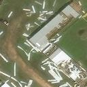

# Data Science Portfolio - Jungsik Noh
This portfolio contains my data science projects for self-learning purposes.
It will be updated on a regular basis. 

## Contact
> **Email**: jungsik.noh@utsouthwestern.edu      
> **LinkedIn**: https://www.linkedin.com/in/jungsik-noh-8a33ab129/ 
 

## Projects

 [**Anomaly Detection Using Autoencoder with Satellite Images of Hurricane Damage and MNIST digits**](https://colab.research.google.com/drive/1ZDphxN3ejxgogC8mKsjEc2dKVdRV9HZw?usp=sharing)

Using autoencoders, anomaly detection is implemented for datasets of satellite images of hurricane damage and MNIST hand-written digits.
Data points with the largest reconstruction errors showed abnormal images in each dataset.

 

 [**Customer Churn Prediction Models**](https://github.com/JungsikNoh/CustomerChurnPredictionModel)

In this project, I demonstrate the steps for building up a churn prediction model using a synthetic insurance customer dataset that mimic real-world dirty data.
An optimal model was searched for across logistic regression, multilayer perceptron, random forest, and decision tree models.

 

 [**Stock Market Time Series Forecasting Using Multi-Layer Perceptron**](https://colab.research.google.com/drive/14qvQmm62H2DMRmNClzYIpJyl2LVLJF2l)

Stock price or return time series are notoriously difficult to predict.
In this analysis, I assess how far we can go with predictive modeling, even under such challenging conditions. 
A Multi-Layer Perceptron (MLP) model is applied to predict whether each S&P500 stock's 5-day future return will fall in the top 20% of the return distribution.
Interesting patterns emerge, and the prediction on test data seems to be better than random guessing at least. 
 

 [**SQL with nycflights13**](https://github.com/JungsikNoh/Data_Science_Portfolio/blob/main/Projects/SQL_with_nycflights13/sql_with_nycflights13.ipynb)

'nycflights13' is a relational database with airline on-time data for all flights departing NYC in 2013 as well as related tables of airlines, airports, planes and weather. In this notebook, I perform an exploratory and descriptive analysis mainly looking into how the departure delay time is related to other variables.
 
 

 

## Research Projects

- [Estimation of the fraction of COVID-19 infected people in U.S. states and countries worldwide](https://github.com/JungsikNoh/COVID19_Estimated-Size-of-Infectious-Population)
  - An Expectation-Maximization-like algorithm is designed to estimate actual numbers of daily new COVID-19 cases in U.S. states based on the daily numbers of confirmed new cases, deaths, and
    key pandemic parameters such as Infection-Fatality-Rate (IFR) in 2020.

- [Granger-causal inference of the lamellipodial actin regulator hierarchy by live cell imaging without perturbation](https://github.com/JungsikNoh/Granger-Causality-Analysis-of-Lamellipodia)
  - A Granger-causality inference framework was developed to dissects cause-effect relations among the protein activity time series extracted from fluorescence microscopic videos of moving cells.
    The pipeline applies instantaneous Granger-causality with time series regression models to thousands of time courses of sub-cellular protein activities that drive cell movement.

- [Combinatorial responsiveness of single chemosensory neurons to external stimulation of mouse explants revealed by DynamicNeuronTracker](https://github.com/JungsikNoh/DynamicNeuronTracker)
  - As a image processing pipeline, a patch-matching iteration algorithm is designed to segment jittering and flickering neurons in 3D calcium imaging data.

 

## Micro Projects

- [nycflights13 database file](https://github.com/JungsikNoh/Data_Science_Portfolio/blob/main/MicroProjects/nycflights13.db)
  - A database (.db) file converted from an [R package nycflights13](https://cran.r-project.org/web/packages/nycflights13/index.html) that contains 
    a dataset of all flights departing NYC in 2013 together with related tables of airlines, airports, weather and planes.

- [Implementation of Apriori Algorithm in Python](https://github.com/JungsikNoh/Data_Science_Portfolio/blob/main/MicroProjects/ImplementationAprioriAlgo.md)
  - Apriori algorithm is used for association rule learning and market basket analysis. 
    It finds frequent itemsets from large-scale transaction data recorded at the 
    point-of-sale (POS).
   
- [Implementation of Breadth First Search (BFS) and Girvan-Newman Algorithm for Graph analysis in R](https://rpubs.com/JungsikNoh/Implement_GirvanNewman_GraphAnalysis_R)
  - Girvan-Newman Algorithm is designed for community detection in a network.
   
- [Implementation of Reservoir Sampling Algorithm in Java](https://github.com/JungsikNoh/Data_Science_Portfolio/blob/main/MicroProjects/Implementation_ReservoirSampling_Java.md)
  - To analyze rapidly arriving data streams where we cannot store all the data points, 
    effective sampling strategies become critical.
    Among those, Reservoir Sampling allows us to keep a sample with a fixed size, say $k$, at any given time, 
    even though the algorithm does not look back at previous data points. 
  
- [Implementation of Hierarchical Clustering (HCL) Algorithm in R](https://rpubs.com/JungsikNoh/ImplementHCLinR)
  - HCL is one of the most useful clustering algorithms. 
    It can also provide an order of data points based on their pairwise distances, 
    which is often useful for various data visualizations. 

 

## Certificates
- [MicroMasters program certificate in Big Data By edX](https://credentials.edx.org/credentials/07ac775f581a4bc5bcd975d77c26ea1d/)
- [SQL Essential Training By LinkedIn](https://www.linkedin.com/learning/certificates/168041ae26e672180d73d1f7c48d5dec48effbed0aae8b8168a73f572fa2142f) 
- [Python for Data Science and Machine Learning Bootcamp By Udemy](https://www.udemy.com/certificate/UC-6dd2f854-bde5-4dd5-8d39-f3b75804cec7/) 

